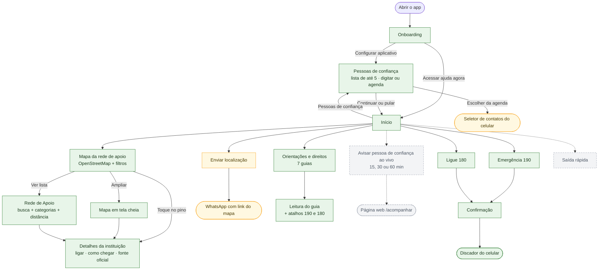
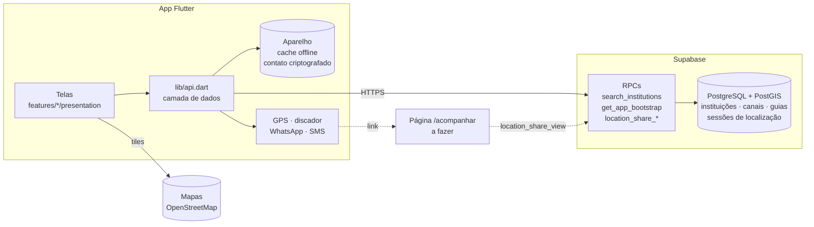

# Rede de Apoio

Projeto extensionista para facilitar o acesso de mulheres à rede de proteção, a contatos de confiança e a canais oficiais. A proposta é orientar e conectar: o produto **não substitui** polícia, Justiça, saúde, assistência social ou atendimento humano especializado.

Piloto: **Curitiba/PR**. Última atualização desta página: 26/09/2026.

## Estado atual

| Área | Situação |
| --- | --- |
| Backend (Supabase) | ✅ Pronto para o MVP: rede de apoio, canais de emergência, guias de direitos e localização ao vivo. Resumo em [API para o front](#api-para-o-front). |
| Camada de dados do app | ✅ Pronta em `app/lib/api.dart`. As telas só consomem. |
| Tela inicial | ✅ Novo visual (vinho/areia, títulos serifados, animações): botão 190, mapa com pinos e abas, atalhos. |
| Mapa em tela cheia | ✅ Painel do local ao tocar no pino; **rota no próprio app** (a pé ou de carro, tempo, distância, passo a passo) e "Iniciar navegação no GPS". A rota depende da função `route` publicada (ver backend). |
| Rede de apoio | ✅ ~90 serviços de Curitiba com coordenadas oficiais (IPPUC): CRAS, CREAS, UPAs 24h, delegacias, Defensoria, Casa da Mulher Brasileira e hospitais de referência. Busca sem acento, filtros, raio de 20 km, selo de verificação, foto da fachada e visão 360° (Street View), ligar e "como chegar". |
| Direitos e orientações | ✅ 7 guias com cache offline e aviso de revisão profissional pendente. |
| Pessoas de confiança | 🟡 Lista de até 5 pessoas, salva só no aparelho (criptografada). Digitar funciona; "Escolher da agenda" usa o seletor do sistema, sem permissão de contatos, e ainda não foi testado em aparelho. |
| Enviar localização | 🟡 Envio da localização atual pelo WhatsApp funciona; ainda não usa o contato salvo. |
| Localização ao vivo | 🟡 Backend e controller prontos; faltam a tela e a página web `/acompanhar`. |
| Saída rápida | ⬜ A fazer. |
| Landing page React | ⬜ Planejada, ainda não inicializada. |
| Testes | ✅ 95 testes Flutter passando; testes do contrato da API em `backend/supabase/tests/api_test.sql`. |

Legenda: ✅ funcionando · 🟡 parcial · ⬜ a fazer.

### Próximos passos

1. Usar a lista de pessoas de confiança em "Enviar localização" (a usuária escolhe para quem enviar).
2. Tela "Avisar pessoa de confiança" com confirmação, escolha de 15/30/60 min e botão "Parar" (usa `LocationShareController`).
3. Página web `/acompanhar` (contrato em [API para o front](#api-para-o-front)).
4. Saída rápida e aviso de limites do app no primeiro uso.
5. Testar "Escolher da agenda" em aparelho Android e acompanhar o `flutter_native_contact_picker`: ele aplica o Kotlin Gradle Plugin (KGP), que versões futuras do Flutter vão recusar no build.

#### Procedimentos complementares de aperfeiçoamento:

1. Otimizar a transmissão de dados e reduzir o uso do banco de dados, utilizando cálculos de área e movimentação. Essa seria uma das principais formas de melhorar o desempenho e a eficiência do aplicativo.

2. Adicionar etapas que possam auxiliar no rastreamento da pessoa durante investigações, salvando uma trilha linear em SVG que registre por onde a pessoa passou e quando o deslocamento foi iniciado.

3. Melhorar a funcionalidade de saída rápida, possibilitando integrá-la ao modo discreto para que ambas as funcionalidades possam ser utilizadas em conjunto.

4. Permitir que a própria usuária personalize as cores do aplicativo. Caso o aplicativo seja expandido nacionalmente, é importante aumentar as possibilidades de personalização para evitar que ele seja facilmente reconhecido visualmente, indo além de simples templates para modificação de ícones.

5. Possivelmente adicionar um modo de economia de bateria, considerando que essa funcionalidade poderá ser necessária em determinadas situações de uso.

6. Adicionar um modo escuro (Dark Mode). Entretanto, é importante considerar que essa alteração pode impactar a segurança da usuária em determinadas situações, principalmente quando o aplicativo estiver sendo utilizado de forma discreta ou quando outra pessoa estiver observando a tela. Em algumas situações, o modo escuro pode dificultar a visualização da tela à distância.

7. Adicionar um modo de emergência, no qual a usuária possa acionar uma sequência específica de botões, como pressionar o botão de desligar duas vezes, para ativar o modo de ligação para a polícia. Essa sequência e outras configurações relacionadas poderiam ser personalizáveis.

8. Existe a possibilidade de expandir ainda mais o aplicativo. Uma das principais mudanças estaria relacionada à política e aos termos de uso, deixando explícito que as informações apresentadas pelo mapa podem estar incorretas. Isso também permitiria tornar a busca mais dinâmica por meio da integração com uma API, como a do Google Maps.

9. Adicionar uma funcionalidade para salvar arquivos criptografados diretamente no celular da usuária, permitindo que esses arquivos sejam protegidos por uma senha definida pela própria usuária e, posteriormente, enviados para serviços externos, como o Google Drive. Dessa forma, seria possível reduzir o uso do banco de dados de maneira prática e funcional.

10. Uma das principais ideias seria implementar um algoritmo de compressão de dados para otimizar a transferência de informações entre o banco de dados e o frontend. Se possível, o frontend poderia realizar a descompressão dos dados após recebê-los. Dessa maneira, seria possível reduzir tanto o volume de dados armazenados no banco quanto o consumo de dados móveis da cliente.

11. Possivelmente, podemos permitir que o contato confiável da usuária possa baixar o arquivo do banco de dados, contendo o histórico de movimentações dela, para fins de investigação etc. Deixaríamos esse tipo de informação com uma forma dinâmica de acesso, já que não podemos prever a infraestrutura e o uso que será feito dela. Dessa forma, preveríamos o uso máximo possível para tal finalidade.

12. Acrescentando ao (1), podemos implementar uma forma de saber dinamicamente quanto de bateria a usuária possui e qual é a qualidade da movimentação de dados. Sendo assim, utilizando o (10), poderíamos comprimir um JSON com esses tipos de dados e inseri-lo diretamente no banco. Porém, teríamos que definir que, caso a bateria esteja acima de 25% (como exemplo), poderíamos evitar a comunicação do celular com o servidor, fazendo com que o servidor presuma que a bateria está em um nível adequado e não precise realizar essa leitura. Também poderíamos enviar ao contato de segurança a informação sobre a bateria do celular caso ela esteja abaixo desse nível e, se estiver em um nível crítico, deixar essa situação visível como um aviso.

Caso a bateria acabe enquanto a localização estiver sendo enviada, podemos presumir que isso ocorreu devido à falta de bateria e avisar o contato de segurança. Podemos também diminuir a frequência de transmissão dos dados, mas isso diminuiria a precisão e a coesão dos dados para o cliente. Além disso, podemos alterar o front-end ou desativar determinadas partes, quando possível, para economizar bateria.

13. Se possível, fazer a distribuição do site do aplicativo usando um proxy, ou no seu uso em si, sendo um dos casos mais pequenos e raros que pode ajudar a usuaria.

## Fluxo do aplicativo (estado atual)



Verde: funcionando. Amarelo: parcial. Cinza tracejado: a fazer. A ajuda imediata (190, 180, rede de apoio e guias) funciona **sem login** e com conteúdo salvo para uso **sem internet**.

## Como as peças se conectam



## Estrutura

```text
app-rede-apoio/
├── app/             # App Flutter (lib/api.dart = camada de dados; features/ = telas)
├── backend/         # Supabase: migrations, testes da API (legacy-node arquivado)
├── landing-page/    # Futura landing page React + página /acompanhar
└── README.md        # Esta página
```

## Executar o aplicativo

Pré-requisitos: Flutter, Android SDK, um JDK completo (com `javac`) e um emulador ou celular Android.

```powershell
cd C:\projetos\app-rede-apoio\app
flutter pub get
flutter analyze
flutter test
```

**No Android:** ligue o emulador, espere a tela inicial do Android aparecer e só então rode o app.

```powershell
& "$env:LOCALAPPDATA\Android\Sdk\emulator\emulator.exe" -avd medium_phone
# em outro terminal, depois que o Android abrir:
cd C:\projetos\app-rede-apoio\app
flutter devices
flutter run
```

**No navegador (teste rápido):** `flutter run -d chrome`. Mapa, lista e guias funcionam; GPS, discador e WhatsApp se comportam diferente do celular.

**Opções de build:**

| Variável | Uso |
| --- | --- |
| `--dart-define=TRACKING_PAGE_URL=https://.../acompanhar` | Liga a localização ao vivo (endereço da página `/acompanhar`). |
| `--dart-define=MAP_TILE_URL=https://.../{z}/{x}/{y}.png` | Troca o servidor de mapas (obrigatório antes de divulgar: a política do OpenStreetMap não permite uso intenso do servidor público por apps; mantenha a atribuição "OpenStreetMap contributors"). |

APKs e logs de execução (`run_log*.txt`) são locais e não vão para o Git.

## Backend

O backend é o Supabase, sem servidor próprio. Banco, API e testes ficam em `backend/supabase/`. Para aplicar e testar as migrations, veja [backend/supabase/README.md](backend/supabase/README.md).

## API para o front

O backend é o Supabase. **O front não escreve SQL nem acessa tabelas diretamente.**

| Item | Valor |
| --- | --- |
| URL | `https://xozcsujnjzoinqhifgfm.supabase.co` |
| Chave | `anon` (pública; está em `app/lib/core/config/supabase_config.dart`) |
| RPC via HTTP | `POST {URL}/rest/v1/rpc/<nome_da_funcao>` com headers `apikey: <chave>` e `Content-Type: application/json` |

### App Flutter

As telas importam só `package:rede_apoio/api.dart`. Sem internet, todas as classes têm um comportamento offline definido.

| Classe | Para quê |
| --- | --- |
| `AppContentRepository.instance.carregar()` | Canais de emergência, categorias e guias (servidor → cache → versão embutida) |
| `EmergencyService.confirmarELigar190(context)` / `discar(numero)` | Ligar. Se `discar` devolver `false`, **mostre o número grande** para discagem manual |
| `ContactMessenger.abrirWhatsApp(numero, texto)` | WhatsApp (ex.: Ligue 180) |
| `SupportNetworkService.buscarInstituicoes(texto:, categorias:, lat:, lng:)` | Rede de apoio; `resultado.offline` indica a lista de contingência |
| `LocationService.obterPosicaoAtual()` | Posição da usuária (`null` sem permissão, GPS ou a tempo) |
| `TrustedContactRepository.instance` | Pessoas de confiança, até 5, só no aparelho: `carregarTodos()`, `adicionar()` (devolve `ResultadoAdicao`), `remover(telefone)` |
| `ShareLocationService.enviarComFallback(...)` | Enviar a localização atual uma vez |
| `LocationShareController` | Localização ao vivo: `iniciar(contato:, minutos:)`, `encerrar()`, `status` |
| `RouteService.calcular(de:, para:, modo:)` | Rota no app (`RoutePlan`: pontos, tempo, distância, passos). Em erro (`RouteException`), ofereça `SupportNetworkService.abrirNoMapa(i, modo:)` |

Antes de compartilhar localização, **sempre mostre uma confirmação** dizendo o quê, com quem e por quanto tempo. O botão de parar fica sempre visível. O modo ao vivo só liga com `--dart-define=TRACKING_PAGE_URL=...`.

### RPCs (HTTP)

| RPC | Parâmetros | Resposta |
| --- | --- | --- |
| `search_institutions` | `q`, `lat`, `lng`, `filter_categories`, `filter_city`, `radius_meters`, `max_results` (padrão 30, máx. 200) | Lista de instituições, com `distance_km` quando há posição |
| `get_app_bootstrap` | `p_state` (`"PR"`), `p_city` (`"Curitiba"`) | Canais, categorias e guias (exemplo em `app/assets/offline/bootstrap_curitiba.json`) |
| `get_emergency_channels` | `p_state`, `p_city` | Canais nacionais, do estado e da cidade |
| `location_share_start` | `duration_min` (5 a 60), `label` (opcional, até 40 caracteres) | `share_id`, `publisher_token`, `viewer_token`, `expires_at`. Erros: `duracao_invalida`, `limite_de_sessoes` |
| `location_share_update` | `publisher_token`, `lat`, `lng`, `accuracy_m` | `active` (`false` = parar de enviar). Erros: `coordenada_invalida`, `sessao_inexistente` |
| `location_share_stop` | `publisher_token` | `true` se encerrou; apaga a posição na hora |
| `location_share_view` | `viewer_token` | `status`, `label`, `latitude`, `longitude`, `accuracy_m`, `updated_at`, `expires_at` |

Na página `/acompanhar`, o `status` de `location_share_view` define o que aparece: `aguardando` ("Aguardando a primeira localização…"), `ativo` (mapa, horário e tempo restante), `encerrado`, `expirado` ou `inexistente` (mensagem, sem posição). A página não salva o token nem a posição, avisa que o link pode ser encaminhado e mostra os canais 190 e 180. Exemplo:

```ts
const token = new URLSearchParams(location.hash.slice(1)).get('t');
const r = await fetch(`${SUPABASE_URL}/rest/v1/rpc/location_share_view`, {
  method: 'POST',
  headers: { apikey: SUPABASE_PUBLISHABLE_KEY, 'Content-Type': 'application/json' },
  body: JSON.stringify({ viewer_token: token }),
});
const [estado] = await r.json(); // consultar a cada 15 s
```

**Função `route`** (`POST {URL}/functions/v1/route`, com `Authorization: Bearer <chave>`): corpo `{"de": {"lat", "lng"}, "para": {"lat", "lng"}, "modo": "a_pe" | "carro"}` (até 80 km). Resposta: `distancia_m`, `duracao_s`, `geometria` (`[[lat, lng], ...]`), `passos` (`instrucao`, `distancia_m`, `duracao_s`, `via`), `atribuicao`. Erros em `{"erro", "mensagem"}`: `coordenada_invalida`, `modo_invalido`, `distancia_excedida` (400), `rota_nao_encontrada` (404), `muitas_requisicoes`/`limite_do_servico` (429), `rotas_indisponiveis` (503, sem chave). A origem vai só ao OpenRouteService para o cálculo e não é gravada.

Tabelas liberadas só para leitura: `institutions` (ativas, sem Casa-Abrigo), `guides`, `emergency_channels`, `institution_categories`. **Sem acesso:** `location_shares`, `institution_review_queue`, `institutions_stale`.

Mudou o banco? Crie uma migration nova, atualize esta seção e rode `backend/supabase/tests/api_test.sql`. Se mudar o formato de `get_app_bootstrap`, regenere o JSON offline com `select get_app_bootstrap('PR', 'Curitiba');`.

## Tecnologias

- **Mobile:** Flutter e Dart. Pacotes principais: `supabase_flutter`, `flutter_map` + `latlong2` (mapa), `flutter_animate` (animações, o equivalente ao Framer Motion), `geolocator`, `url_launcher`, `flutter_secure_storage`, `shared_preferences`, `flutter_native_contact_picker` (agenda).
- **Backend:** Supabase (PostgreSQL + PostGIS, RPCs em SQL).
- **Mapas:** OpenStreetMap (atribuição obrigatória), com filtro de cor suave.
- **Rotas:** OpenRouteService via Edge Function do Supabase (chave só no servidor).
- **Visual:** paleta vinho/areia/musgo; títulos em Fraunces e texto em Atkinson Hyperlegible (fontes embutidas, licença OFL).
- **Landing page:** React e TypeScript (a iniciar).

## Segurança

### Regras inegociáveis

1. A ajuda imediata não pode depender de login, cadastro ou internet.
2. Nunca alegar que uma ação automática acionou polícia, emergência ou boletim de ocorrência.
3. Localização só pode ser coletada e compartilhada mediante consentimento explícito, específico e revogável.
4. Não persistir localização contínua, relatos, documentos ou evidências sem arquitetura de segurança, LGPD, retenção mínima e revisão humana.
5. Falhas de rede, permissões e integrações são estados normais da interface e devem ter uma saída segura.
6. Não prometer “invisibilidade total” diante de um agressor; comunicar os limites de segurança com honestidade.
7. Integrações com órgãos públicos dependem de parceria, canal oficial e validação jurídica/técnica. Não simular esse envio.

### Como o app cumpre hoje

- Localização só é obtida ou compartilhada com consentimento explícito, e o compartilhamento ao vivo tem prazo e botão de parar.
- As pessoas de confiança ficam só no celular, criptografadas; não há login nem conta.
- O servidor guarda só a última posição de um compartilhamento ativo e apaga ao encerrar.
- Endereços de Casa-Abrigo nunca são cadastrados nem exibidos.
- O app não aciona polícia, não registra BO e não promete invisibilidade no aparelho.
- Dados de instituições são curados a partir de fontes oficiais e mostram a data de verificação.

## Convenções para quem desenvolve

- Flutter: organize código em `app/lib/features/`, `app/lib/core/` e `app/lib/app/`. Em cada feature: `data/` (acesso a dados), `domain/` (modelos) e `presentation/` (telas).
- Telas só usam o que está exportado em `app/lib/api.dart`; não chamam o Supabase diretamente.
- Banco: toda mudança é uma migration nova em `backend/supabase/migrations/`; atualize a seção [API para o front](#api-para-o-front) e rode `backend/supabase/tests/api_test.sql`.
- Linguagens: Dart no app, TypeScript (`.ts`/`.tsx`) na web e SQL só nas migrations. O app roda em Android e web (Chrome, para testes); não adicione outras plataformas Flutter sem necessidade.
- Landing page e página `/acompanhar`: React com TypeScript (TSX), em `landing-page/`.
- Todo pacote novo exige justificativa de privacidade, manutenção e licença (tabela de pacotes em `app/README.md`).
- Não versionar APKs, caches, arquivos locais do Android, chaves, tokens ou arquivos `.env`.
- Antes de concluir uma mudança Flutter, rode `flutter analyze` e `flutter test` dentro de `app/`.
- Espaçamentos: use `AppSpacing` (`app/lib/core/theme/app_spacing.dart`), grade de 4 pt com margem lateral de 20 (`AppSpacing.screen`). Não use números soltos em `EdgeInsets`, `SizedBox` ou `spacing`.
- Botões dentro de `Row` precisam de `minimumSize` explícito (o tema usa largura infinita) ou de `Expanded`. Veja "Cuidados conhecidos" em `app/README.md`.
- Ao mudar telas ou fluxos, atualize o fluxograma deste README. Ao concluir uma etapa, atualize o quadro "Estado atual" e os "Próximos passos".

## Documentação

- [App Flutter: comandos, pacotes e cuidados conhecidos](app/README.md)
- [Backend Supabase](backend/README.md)
- [Migrations, testes e curadoria dos dados](backend/supabase/README.md)
- [Landing page e página /acompanhar](landing-page/README.md)
